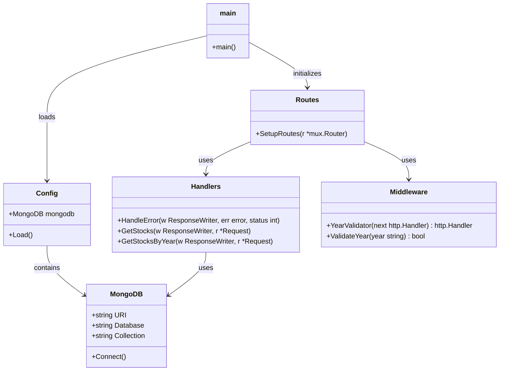
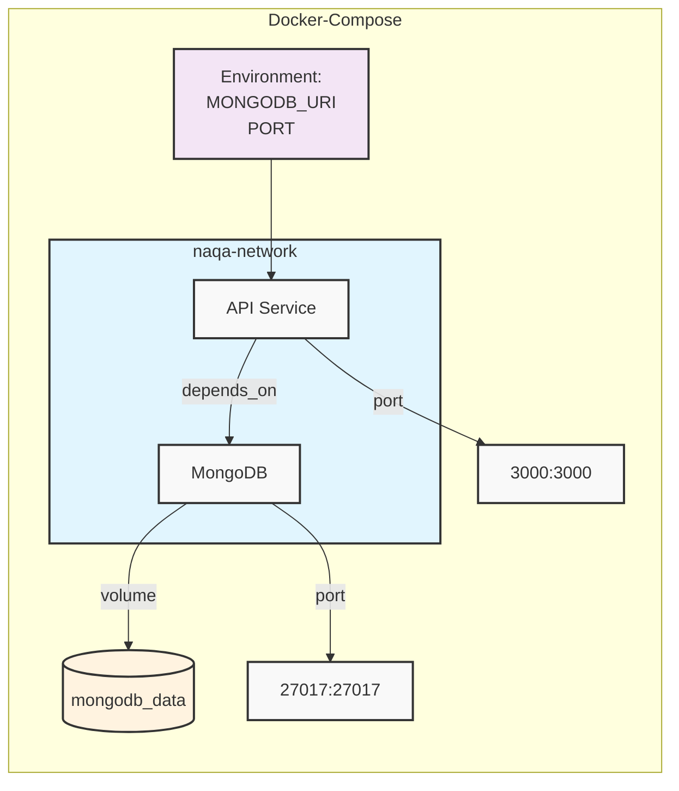

# NAQA API | نقاء API

[](https://golang.org/)
[](https://goreportcard.com/report/github.com/anqorithm/naqa-api)
[](LICENSE)
[](https://github.com/anqorithm/naqa-api)
[](https://github.com/anqorithm/naqa-api/commits/main)
[](https://www.mongodb.com/)
[](https://gofiber.io/)
[](https://cloud.google.com/run)

<div dir="rtl">

## نظرة عامة | Overview
نقاء API هي خدمة RESTful مصممة لتوفير بيانات عن عملية تطهير الأسهم السعودية. توفر الخدمة معلومات دقيقة عن نسب التطهير للأسهم في السوق السعودي وتصنيفها الشرعي.

### المميزات الرئيسية | Key Features
- 🧮 حساب مبلغ التطهير للأسهم | Stock Purification Amount Calculator
- 🔍 البحث في الأسهم حسب القطاع والتصنيف الشرعي | Search Stocks by Sector and Shariah Classification
- 📊 معلومات محدثة عن الأسهم النقية والمختلطة | Updated Pure and Mixed Stocks Information
- 🌐 دعم كامل للغة العربية | Full Arabic Language Support
- 🔄 واجهة برمجة تطبيقات RESTful سهلة الاستخدام | Easy-to-use RESTful API

### المتطلبات | Requirements
- Go 1.23.4 أو أحدث | or higher
- Git
- MongoDB

### تثبيت المشروع | Project Setup
```bash
git clone https://github.com/anqorithm/naqa-api
cd naqa-api
go mod download
```

### المتغيرات البيئية | Environment Variables
```bash
MONGO_URI=       # رابط قاعدة البيانات | Database URL
MONGO_DATABASE=  # اسم قاعدة البيانات | Database Name
PORT=           # منفذ الخدمة | Service Port
```

### التصنيف الشرعي | Shariah Classification
- نقية | Pure: أسهم متوافقة تماماً مع الشريعة | Fully Shariah Compliant Stocks
- مختلطة | Mixed: أسهم تحتاج إلى تطهير | Stocks Requiring Purification
- غير متوافقة | Non-Compliant: أسهم غير متوافقة مع الشريعة | Non-Shariah Compliant Stocks

### السنوات المدعومة | Supported Years
> السنوات المتوفرة | Available Years: 2018, 2019, 2020, 2021, 2022, 2023

</div>

---

## Overview
NAQA API is a RESTful service designed to provide data about the purification process of Saudi stocks. The service offers accurate information about stock purification rates in the Saudi market and their Shariah classification.

### Key Features
- 🧮 Calculate stock purification amounts
- 🔍 Search stocks by sector and Shariah classification
- 📊 Updated information about pure and mixed stocks
- 🌐 Full Arabic language support
- 🔄 Easy-to-use RESTful API

### Prerequisites
- Go 1.23.4 or higher
- Git
- MongoDB

## Version Information
- Version: 1.0.0
- Environment: Development
- Base API Path: `/api/v1`

## Quick Start

1. Clone the repository:
```bash
git clone https://github.com/anqorithm/naqa-api
cd naqa-api
```

2. Install dependencies:
```bash
go mod download
```

3. Set up environment variables:
```bash
cp .env.example .env
# Edit .env with your configurations
```

## Installation
1. Clone the project.
2. Install Go dependencies:
   ```
   go mod download
   ```

## Environment
Set the following environment variables or edit the .env file:
- MONGO_URI
- MONGO_DATABASE
- PORT

## Usage
1. Run the server:
   ```
   go run cmd/api/main.go
   ```
2. Access the API at:
   ```
   http://localhost:3000/api/v1
   ```

## Environment Variables

Before running the application, make sure to set up your environment variables:

```bash
# Copy the example env file
cp .env.example .env

# Fill in your environment variables in .env file:
API_VERSION      # API version
ENVIRONMENT      # development, production, etc.
PORT            # Server port
APP_NAME        # Application name
APP_DESCRIPTION # Application description
MONGO_URI      # MongoDB connection URI
MONGO_DATABASE # MongoDB database name
```

## Running the Application

### Local Development
```bash
go run cmd/api/main.go
```
Server will start at `http://localhost:3000`

### Docker Setup

#### Using Docker Compose (Recommended)
```bash
# Start services
docker-compose up -d

# Stop services
docker-compose down
```

#### Manual Docker Build
```bash
# Build image
docker build -t naqa-api .

# Run container
docker run -d -p 3000:3000 naqa-api
```

## API Endpoints

### Base URL
`http://localhost:3000/api/v1`

### Available Endpoints
```http
## Environment Variables
@baseUrl = http://localhost:3030  
@contentType = application/json

### Health Check
GET {{baseUrl}}/api/health  
Content-Type: {{contentType}}

### Metrics Dashboard
GET {{baseUrl}}/metrics  
Content-Type: {{contentType}}

### Root Endpoint
GET {{baseUrl}}/  
Content-Type: {{contentType}}

### Get Stocks by Year
GET {{baseUrl}}/api/v1/stocks/year/2025  
Content-Type: {{contentType}}

### Search Stocks with Parameters
GET {{baseUrl}}/api/v1/stocks/year/2023/search?name=aramco&sector=energy&sharia_opinion=نقية  
Content-Type: {{contentType}}

### Calculate Purification Amount
POST {{baseUrl}}/api/v1/stocks/calculate-purification  
Content-Type: {{contentType}}

```

### Search Examples

#### Search by Name
```http
GET {{baseUrl}}/api/v1/stocks/year/2023/search?name=%D8%A3%D8%B1%D8%A7%D9%85%D9%83%D9%88  
Content-Type: {{contentType}}
```

#### Search by Code
```http
GET {{baseUrl}}/api/v1/stocks/year/2023/search?code=2222  
Content-Type: {{contentType}}
```

#### Search by Sector
```http
GET {{baseUrl}}/api/v1/stocks/year/2023/search?sector=%D8%A7%D9%84%D8%B7%D8%A7%D9%82%D8%A9  
Content-Type: {{contentType}}
```

#### Search by Sharia Opinion
```http
GET {{baseUrl}}/api/v1/stocks/year/2023/search?sharia_opinion=%D9%86%D9%82%D9%8A%D8%A9  
Content-Type: {{contentType}}
```

#### Combined Search
```http
GET {{baseUrl}}/api/v1/stocks/year/2023/search?sector=%D8%A7%D9%84%D8%B7%D8%A7%D9%82%D8%A9&sharia_opinion=%D9%86%D9%82%D9%8A%D8%A9  
Content-Type: {{contentType}}
```

### Inspiration and Data Source

This API is inspired by [NaqausStocks.com](https://naquastocks.com/).

Data source: [Almaqased Cleansing Calculator](https://almaqased.net/cleansing-calculator/%D9%82%D9%88%D8%A7%D8%A6%D9%85-%D8%A7%D9%84%D8%AA%D8%AD%D9%84%D9%8A%D9%84-%D8%A7%D9%84%D9%85%D8%A7%D9%84%D9%8A-%D9%84%D9%84%D8%B4%D8%B1%D9%83%D8%A7%D8%AA/)  
المشرف العام: د. محمد بن سعود العصيمي


> **Note:** Supported Years: 2018, 2019, 2020, 2021, 2022, 2023


## Development

### Project Structure
```
.
├── cmd
│   └── api
│       └── main.go
├── docker-compose.yml
├── Dockerfile
├── docs
│   ├── docs.go
│   ├── swagger.json
│   └── swagger.yaml
├── go.mod
├── go.sum
├── internal
│   ├── config
│   │   ├── config.go
│   │   └── mongodb.go
│   ├── handlers
│   │   ├── handlers.go
│   │   └── stocks.go
│   ├── middleware
│   │   ├── middleware.go
│   │   └── year_validator.go
│   └── routes
│       └── routes.go
├── LICENSE
├── Makefile
└── README.md
```

## Architecture Design & Diagrams

### Class Diagram



### Docker-Compose Diagram



### Building for Production
```bash
go build -o naqa-api cmd/api/main.go
```

## License

This project is licensed under the MIT License - see the [LICENSE](LICENSE) file for details.

## Credits

### Data Source
- [Almaqased Cleansing Calculator](https://almaqased.net/)
- المشرف العام: د. محمد بن سعود العصيمي

### Inspiration
This API is inspired by [NaqausStocks.com](https://naquastocks.com/)
